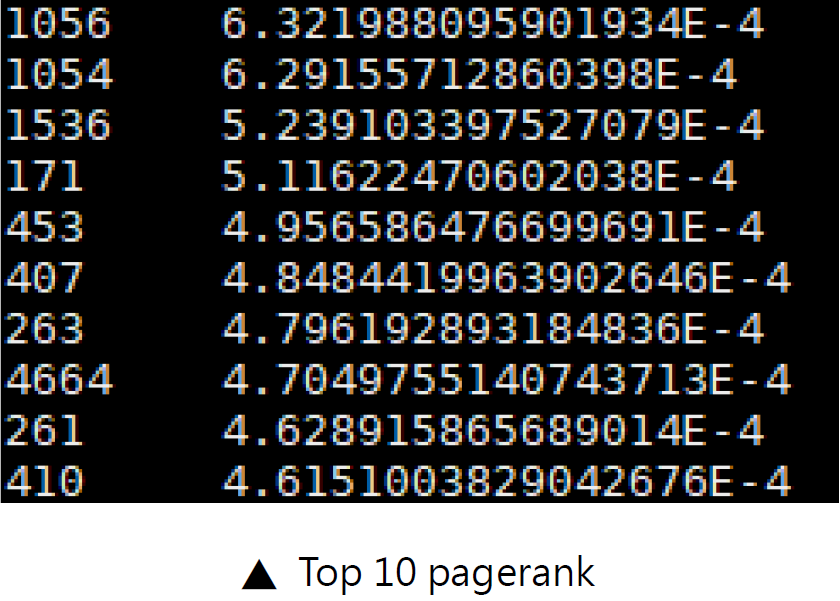
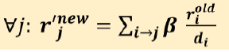
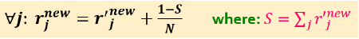
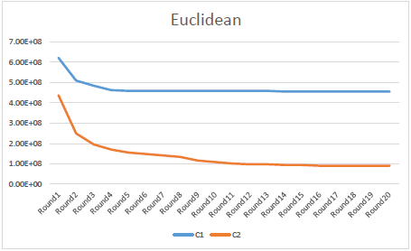
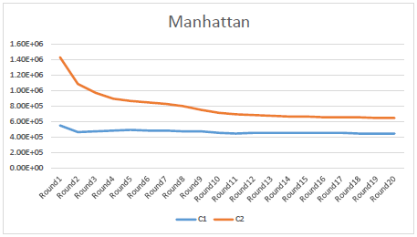
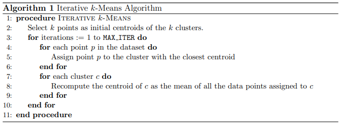

# Hadoop-MapReduce
implementation of algorithms with Hadoop MapReduce

## PageRank

Step 1： Sum contributions of links and then multiply β to solve 'spider traps'。

Step 2： Renormalize r to re-insert the leaked PageRank casued by 'dead-ends'。

## LSH

## K-means

c1：randomly initialized centroids

c2：centroids which are as far apart as possible

